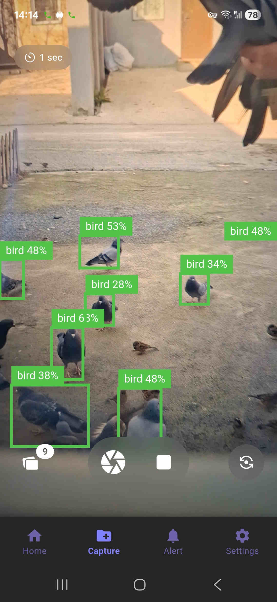
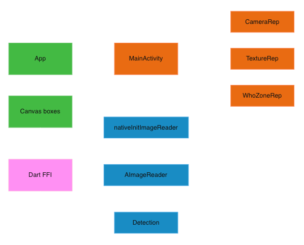

## WhoZone

This app serves as a playground for exploring YOLO11 models with practical application<br>



## Features
* **Real-Time Object Detection**: YOLO11 inference pipeline powered by a hardware-accelerated C++ backend.
* **Native Surface Integration**: Utilizes `AImageReader` via JNI to achieve zero-copy frame ingestion.
* **Object Tracking**: Implements **Kalman filtering** to maintain bounding box consistency and smooth motion across camera frames.
* **Event Bus**: bidirectional communication between the native C++ engine and Flutter UI, serialized via **Protocol Buffers** and FFI.
* **UI**: Adaptive bounding box.

## How to start
```bash
git clone https://github.com/khomin/WhoZone.git --recurse-submodule

./scripts/build_protobuf.sh android

./scripts/build_opencv.sh android

flutter run --debug
```

## In case you want a model from scratch
```bash
cd ./resources
python3 -m venv yolo_env
source ./yolo_env/bin/activate
pip install --upgrade pip
pip install ultralytics
yolo export model=yolo11n.pt format=onnx imgsz=320 opset=17
cp yolo11n.pt ./android/app/src/main/assets
```

## How to generate protobuf files
```bash
./scripts/gen_proto.sh
```

## How to update DI
```bash
dart run build_runner build
```

## 📋 Prerequisites
Macos or Linux, Android studio with NDK
